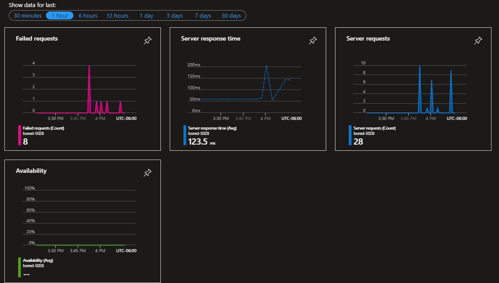
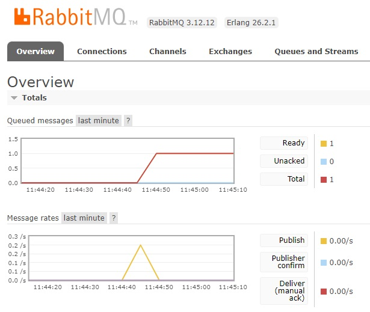

<ins>The purpose of this repository is for a University assignment for 5028 - Applications of Software Architecture for Big Data</ins>

This University project is hosted with a free subscription on Azure, therefore timeouts and poor performance are expected as the resouces comes in crumbs.

Using C#/ASP.NET Core v8.0.X

- Production Site: https://bored-5028.azurewebsites.net/
- REST API being utilized: https://www.boredapi.com/
- Unit testing done with xUnit.net
- CI/CD defined in Bored.yaml and deployed to Azure via GitHub Actions
- SQL Server Database hosted on Azure
- Charting done with Chart.js
- Monitoring and Reporting Azure Service Snap Shots:

- Direct Message Queue done with RabbitMQ. Producer will tell consumer to add record to database if the record does not exist.

